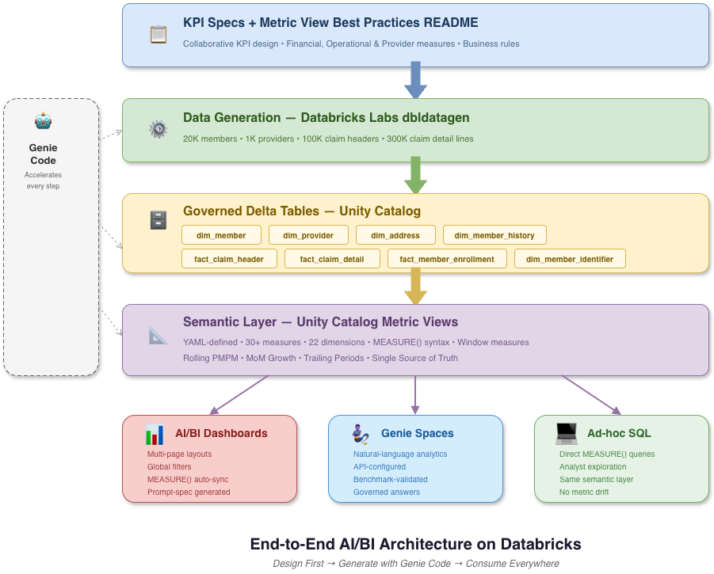
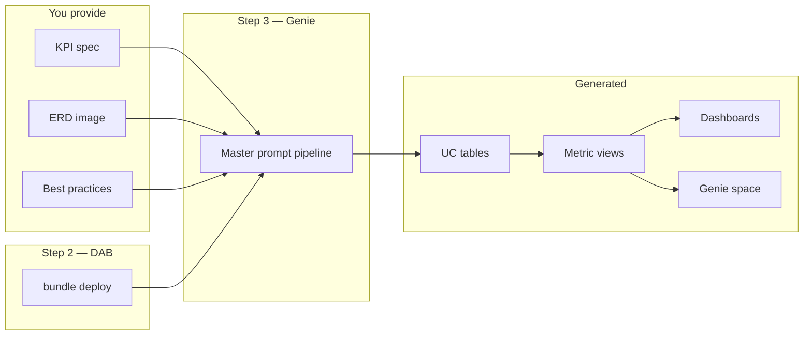
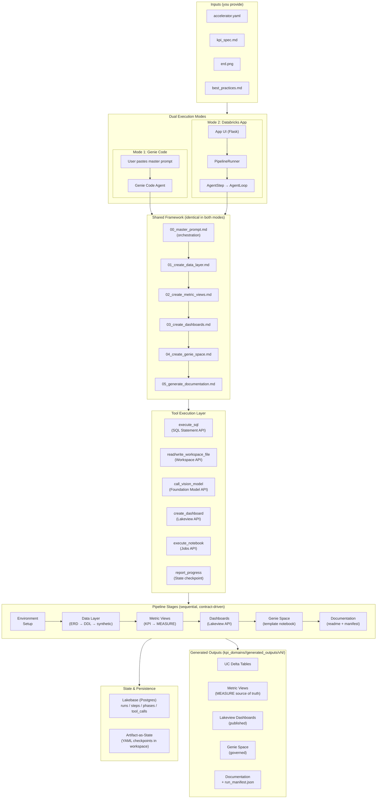
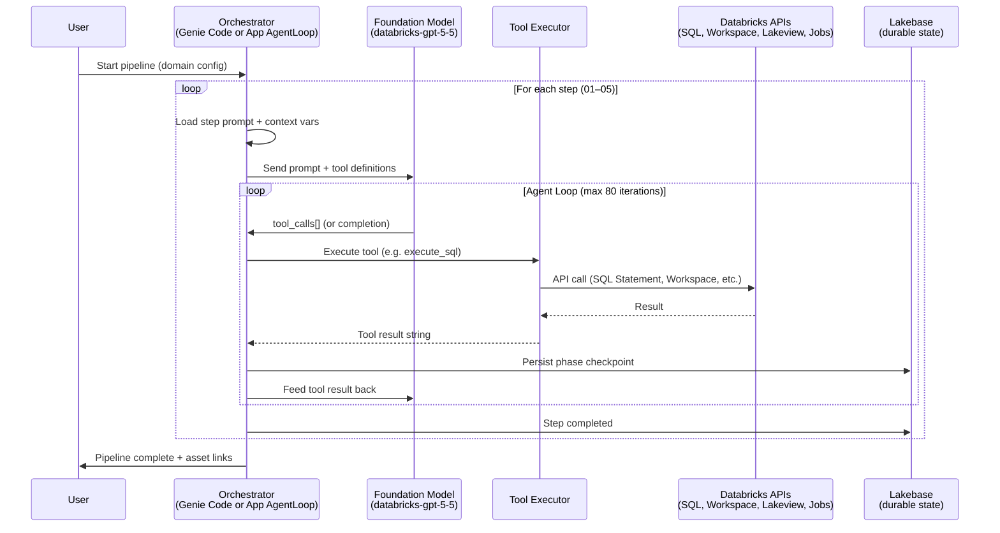

# AIBI Design-First Accelerator



## Design-first AI/BI on Databricks — greenfield or brownfield

**Why we built this:** Teams already start AI/BI work with the right design—KPI catalogs, data models, governance rules—but each engagement still hand-builds tables, Metric View YAML, Lakeview dashboards, and Genie spaces from scratch. Metrics drift across SQL and BI; POCs burn weeks before anyone can ask real questions.

**What it gives you:** One Genie pipeline, two starting points:

- **Greenfield** — KPI spec + **ERD image** + best practices → synthetic UC tables, **Metric Views**, **dashboards**, and **Genie** (hours to a governed demo).
- **Brownfield** — KPI spec + **existing UC schema(s)** (one or many catalogs/schemas, no ERD) → profile live data, same semantic and consumption stack on production tables.

Both paths share a single `MEASURE()` source of truth. **DAB** deploys the toolkit; **Genie** generates assets. Start synthetic, switch to `live_schema` when you connect real data.

Built for **customers**, **data platform teams**, **analytics engineers**, and **Solution Architects**.

**[Design guide](docs/design.md)** · **[Configuration](docs/design.md#configuration)** · **[Validation](docs/design.md#validation)**

---

## Get started in 3 steps

From clone to a full synthetic healthcare stack on your workspace in three moves.

### 1. Configure

Edit two files before deploy:

**[`databricks.yml`](databricks.yml)** — workspace and warehouse:

```yaml
variables:
  sql_warehouse_id:
    default: "<your-sql-warehouse-id>"

targets:
  dev:
    workspace:
      host: https://<your-workspace>.cloud.databricks.com/
```

`deploy_root` uses `${workspace.current_user.userName}` — no hardcoded email.

**[`kpi_domains/member_claims/accelerator.yaml`](kpi_domains/member_claims/accelerator.yaml)** — catalogs and schemas (adjust for your UC):

```yaml
catalog:
  source:
    catalog: aira_test
    schema: member_claims_source
  target:
    catalog: aira_test
    schema: member_claims_semantic
```

Validate locally:

```bash
python3 scripts/validate_dab_config.py kpi_domains/member_claims
```

### 2. Deploy

Install the [Databricks CLI](https://docs.databricks.com/en/dev-tools/cli/install.html) (v0.218+), authenticate (`databricks auth login --host <your-host>`), then:

```bash
cd aibi-design-first-accelerator
databricks bundle validate -t dev
databricks bundle deploy -t dev
```

Files sync to:

`/Workspace/Users/<you>/aibi-design-first-accelerator/`

### 3. Run Genie

Open **Databricks Genie** (agent) and paste:

```
Execute the master prompt at /Workspace/Users/<you>/aibi-design-first-accelerator/framework/prompts/00_master_prompt.md with EXAMPLE_DIR /Workspace/Users/<you>/aibi-design-first-accelerator/kpi_domains/member_claims — run end to end.
```

Replace `<you>` with your workspace user name. The master prompt loads `accelerator.yaml` from **EXAMPLE_DIR** and runs the full pipeline.

**Agentic execution:** Genie should resolve paths from config, follow step prompts, and finish with minimal manual intervention.

Generated assets land under `kpi_domains/member_claims/generated_outputs/v1/` (auto-versioned — each run increments). Both the App UI and Agent Code paths produce identical versioned output.

---

## How it works



| Step | Tool | What happens |
|------|------|----------------|
| 1 | You | KPI spec + ERD (+ optional existing schema) |
| 2 | DAB | Sync `framework/` + `kpi_domains/<domain>/` to workspace |
| 3 | Genie | Orchestrated prompts → data, semantic layer, consumption |

---

## End-to-End Architecture

The accelerator supports two identical execution modes — **Genie Code** (interactive chat) and **Databricks App** (programmatic). Both use the same framework prompts, same tools, and produce the same versioned outputs.



### Execution Flow Detail



### Key Architecture Decisions

| Decision | Rationale |
|----------|----------|
| **Same prompts for Genie Code and App** | Ensures consistent behavior regardless of execution mode; prompts are the single source of truth |
| **Contract-driven pipeline** | Each stage produces validated artifacts consumed downstream; no stage can repair upstream failures |
| **Artifact-as-state checkpointing** | Generated files (YAML, manifests) ARE the state; enables resume without external DB dependency |
| **Lakebase persistence** | Durable run/step/phase/tool_call records enable refresh-safe UI and cross-session resume |
| **Critical tool fail-fast** | DDL, notebook execution, and dashboard creation failures halt immediately (no silent adaptation) |
| **Template notebook pattern** | Genie space + synthetic data use notebooks executed via Jobs API (not raw subprocess) |

---

## Platform

| Capability | Description |
|------------|-------------|
| **Data layer** | **Greenfield:** ERD image → DDL + synthetic data. **Brownfield:** profile existing UC tables across one or many `catalog.schema` locations (no synthetic run). |
| **Semantic layer** | Unity Catalog Metric Views from KPI spec + [best practices](framework/inputs/best_practices.md) |
| **Dashboards** | Live AI/BI Lakeview dashboards — see [Design guide → Framework](docs/design.md#framework-reference) |
| **Genie** | Configuration notebook + governed Genie space |
| **Validation** | [Design guide → Validation](docs/design.md#validation) |

**Inputs (everything else is generated):**

| Input | Greenfield | Brownfield |
|-------|------------|------------|
| KPI specification | `kpi_domains/<domain>/inputs/kpi_spec.md` | Same |
| Best practices | `framework/inputs/best_practices.md` | Same |
| Data model | `inputs/erd.png` | `data_source.live_schemas[]` or `live_schema` pointing at existing UC tables (no ERD) |

---

## Examples

### `member_claims` — try it first (synthetic healthcare)

Reference module with a star-schema ERD and KPI catalog. **Inputs only in git** — Genie generates tables, metric views, dashboards, and Genie under `output/`.

```
kpi_domains/member_claims/
├── accelerator.yaml
└── inputs/
    ├── erd.png
    └── kpi_spec.md
```

Use the [3-step flow above](#get-started-in-3-steps) with `kpi_domains/member_claims`.

**After a successful run:**

```
.../kpi_domains/member_claims/generated_outputs/
├── erd_parsed.yaml
├── notebooks/
├── metric_views/
├── dashboards/          # manifest JSON (dashboard_id, links) — live dashboards in AI/BI
├── genie_space/
└── readme.md
```

### Your own domain

```bash
cp -r kpi_domains/member_claims kpi_domains/<your_domain>
```

| Task | Action |
|------|--------|
| KPIs | Edit from [`framework/inputs/kpi_spec.template.md`](framework/inputs/kpi_spec.template.md) |
| ERD | Replace `inputs/erd.png` |
| Config | Update `accelerator.yaml` — `domain.name` must match folder name |
| DAB | Set `variables.example_domain` and add `kpi_domains/<your_domain>` to `sync.paths` in [`databricks.yml`](databricks.yml) — see [Deploy](docs/design.md#deploy) |
| Run | `validate_dab_config.py` → `bundle deploy` → execute the same master prompt (new `kpi_domains/<domain>/`) |

| Mode | `data_source.type` | Behavior |
|------|-------------------|----------|
| Greenfield | `erd` | ERD → DDL + synthetic data |
| Brownfield | `live_schema` | Profile existing tables; **no** synthetic generation |
| Brownfield (multi-schema) | `live_schema` + `live_schemas[]` | Profile multiple `catalog.schema` locations; cross-schema joins in metric views |
| Both | `erd_and_live_schema` | Optional greenfield + validate against live |

Brownfield YAML examples — see [Design guide → Configuration](docs/design.md#configuration).

---

## Why teams use this

| Challenge | How the accelerator helps |
|-----------|---------------------------|
| Weeks to wire KPIs into AI/BI assets | Structured Genie pipeline with shared prompts and templates |
| Metric drift across SQL, dashboards, Genie | One `MEASURE()` source of truth in Metric Views |
| Unclear “done” for a POC | [Validation checklist](docs/design.md#validation) + generated run summary |
| Hard to move from prototype to production | Start greenfield (`erd`), then switch to `live_schema` — [Configuration](docs/design.md#data-source-modes) |

**Typical journey:** run the sample → customize KPIs and ERD → re-run → connect real data → promote to shared UC.

---

## Prerequisites

- Databricks workspace with **Unity Catalog**, **AI/BI / Lakeview**, and **Genie**
- SQL warehouse (Pro or Serverless)
- [Databricks CLI](https://docs.databricks.com/en/dev-tools/cli/install.html) v0.218+ with authentication
- **Genie Code** with workspace file access
- Python 3.9+ (optional, for `scripts/validate_dab_config.py`)

---

## Troubleshooting

See [Design guide → Troubleshooting](docs/design.md#troubleshooting).

---

## Repository structure

```
aibi-design-first-accelerator/
├── databricks.yml           # Workspace + DAB deploy
├── framework/               # Prompts, templates, shared inputs (immutable)
├── kpi_domains/
│   └── member_claims/       # Reference example (inputs + config)
├── docs/                    # Design guide (single doc)
├── scripts/                 # validate_dab_config.py
└── VALIDATION.md            # → docs/design.md#validation
```

Genie pipeline: `framework/prompts/00_master_prompt.md` → steps `01`–`06`. Details: [Design guide](docs/design.md).

---

## Appendix: Configuration

Detailed reference lives in **[docs/design.md](docs/design.md)** — one design document for the accelerator.

| Topic | Section |
|-------|---------|
| **Configuration** | [Configuration](docs/design.md#configuration) — `databricks.yml`, `accelerator.yaml`, paths, EXAMPLE_DIR, data modes, `clean_start` |
| **Deploy** | [Deploy](docs/design.md#deploy) — DAB commands, workspace layout, add example modules, Genie kickoff |
| **Validation** | [Validation](docs/design.md#validation) — definition of done, KPI checks |
| **Framework reference** | [Framework reference](docs/design.md#framework-reference) — inputs, prompts, templates, examples |
| **Troubleshooting** | [Troubleshooting](docs/design.md#troubleshooting) |

---

## Contributing

Issues and pull requests welcome. Maintainer notes live under [`plan/`](plan/).

---

## How to get help

Databricks support doesn't cover this content. For questions or bugs, please open a GitHub issue and the team will help on a best effort basis.


## License

&copy; 2025 Databricks, Inc. All rights reserved. The source in this notebook is provided subject to the Databricks License [https://databricks.com/db-license-source].  All included or referenced third party libraries are subject to the licenses set forth below.

| library                                | description             | license    | source                                              |
|----------------------------------------|-------------------------|------------|-----------------------------------------------------|


