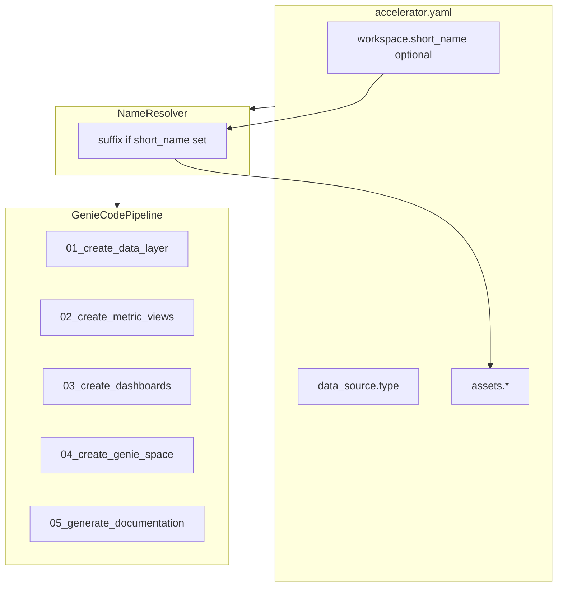

# AIBI Design-First Accelerator — Implementation Plan

**Jira:** [FEIP-7399](https://databricks.atlassian.net/browse/FEIP-7399)  
**Repo:** `aibi-design-first-accelerator/`

Requirements summary: [FEIP_REQUIREMENTS.md](./FEIP_REQUIREMENTS.md)

---

## Implementation checklist

- [x] **Phase 1** — Scaffold generic framework + YAML schema
- [x] **Phase 2** — Prompts (00–05), templates, naming resolver
- [x] **Phase 3** — Documentation + runbook (`README`, `VALIDATION.md`, `accelerator-schema.md`)
- [x] **Phase 4** — Reference validation (`examples/member_claims` — migrate legacy, run pipeline, verify outputs)

---

## Naming conventions

**Do not use `workshop` in any framework or generated asset filename.**

**All generated Databricks assets use snake_case:** lowercase, digits, underscores only. No spaces, hyphens, or Title Case in workspace/UC object names or output filenames.

### Optional user suffix (`workspace.short_name`)

`short_name` is an **optional** config value (typically derived from email: `jane.doe` → `jane_doe`).

| `workspace.short_name` | Asset name pattern | Example metric view |
|------------------------|-------------------|---------------------|
| `null` / omitted | `{domain}_{kind}_{descriptor}` | `healthcare_kpis_metric_view` |
| set (e.g. `jane_doe`) | `{domain}_{kind}_{descriptor}_{short_name}` | `healthcare_kpis_metric_view_jane_doe` |

**Resolver rule (all prompts must apply):**

```
suffix = f"_{short_name}" if short_name else ""
asset_name = f"{domain}_{kind}_{descriptor}{suffix}"
```

Use resolved names from `accelerator.yaml` → `assets.*` (prompts may compute defaults from templates if names omitted).

### By asset type (generic)

| Asset | Name when `short_name` is null | Name when `short_name` is `jane_doe` |
|-------|--------------------------------|--------------------------------------|
| Metric view | `{domain}_metric_view` | `{domain}_metric_view_jane_doe` |
| Dashboard | `{domain}_{id}_dashboard` | `{domain}_{id}_dashboard_jane_doe` |
| Genie space | `{domain}_analytics_genie` | `{domain}_analytics_genie_jane_doe` |
| Genie notebook | `genie_space_configuration_{domain}` | `genie_space_configuration_{domain}_jane_doe` |
| Sample SQL | `sample_queries_{domain}.sql` | `sample_queries_{domain}_jane_doe.sql` |

### Framework repo files

| Context | Convention |
|---------|------------|
| Prompt files | `NN_<verb>_<noun>.md` |
| UC schemas | `{domain}_source`, `{domain}_semantic` (from config, not hardcoded) |
| Output folder | `/Workspace/Users/{email}/aibi-accelerator/{domain}` or `.../{domain}/{short_name}` when suffix is set |

### Prompt enforcement

- Steps 03–04 use **resolved** names from YAML; reject names with spaces, uppercase, or hyphens.
- Human-readable titles may live inside dashboard/Genie JSON metadata only.

---

## Target repo layout

```
aibi-design-first-accelerator/
├── plan/
├── README.md
├── docs/
│   ├── architecture-diagram.drawio
│   ├── images/architecture-diagram.png
│   └── accelerator-schema.md
├── framework/
│   ├── schema/
│   │   └── accelerator.schema.yaml
│   ├── inputs/
│   │   ├── kpi_spec.template.md
│   │   └── best_practices.md
│   ├── templates/
│   │   ├── genie_space_notebook.py.template
│   │   ├── ddl_notebook.py.template
│   │   ├── dbldatagen_notebook.py.template
│   │   └── metric_view_yaml.header.yaml
│   └── prompts/
│       ├── 00_master_prompt.md
│       ├── 01_create_data_layer.md
│       ├── 02_create_metric_views.md
│       ├── 03_create_dashboards.md
│       ├── 04_create_genie_space.md
│       ├── 05_generate_documentation.md
├── examples/
│   └── member_claims/             # inputs + accelerator.yaml only; assets generated at runtime
└── utils/notebooks/
```

**Design principle:** `framework/` is immutable. Each domain folder under `examples/` contains only `accelerator.yaml` and `inputs/` (ERD image + KPI spec). All deliverables go to `workspace.output_folder`.

---

## YAML config model (`accelerator.yaml`)

All prompts begin with: *Read `accelerator.yaml`; resolve paths relative to the example folder; apply `short_name` suffix rules.*

```yaml
version: "1.0"

domain:
  name: healthcare                    # snake_case slug
  display_name: Healthcare Analytics  # optional; UI/docs only

workspace:
  user_email: your.name@company.com
  short_name: null                    # or jane_doe — suffixes asset names when set
  output_folder: /Workspace/Users/${workspace.user_email}/aibi-accelerator/${domain.name}
  # When short_name is set, append: .../${domain.name}/${workspace.short_name}
  sql_warehouse_id: "<warehouse-id>"

catalog:
  source:
    catalog: <catalog>
    schema: ${domain.name}_source
  target:
    catalog: <catalog>
    schema: ${domain.name}_semantic

data_source:
  type: erd                           # erd | live_schema | erd_and_live_schema
  erd:
    image: inputs/erd.png
  live_schema:
    catalog: ${catalog.source.catalog}
    schema: ${catalog.source.schema}
  live_schemas: []                    # optional: [{catalog, schema, tables?, label?}, ...]
  greenfield:
    enabled: true
    synthetic_data: true
    volume: {}                        # domain-specific; defined in erd or kpi spec

inputs:
  kpi_spec: inputs/kpi_spec.md
  best_practices: ../../framework/inputs/best_practices.md

assets:
  # Names may omit suffix; prompts resolve using short_name rule above
  metric_views:
    - name: ${domain.name}_metric_view
      primary: true
  dashboards:
    - id: kpis
      name: ${domain.name}_kpis_dashboard
    - id: utilization
      name: ${domain.name}_utilization_dashboard
  genie:
    space_name: ${domain.name}_analytics_genie
    notebook_name: genie_space_configuration_${domain.name}
  sample_queries_file: sample_queries_${domain.name}.sql

templates:
  genie_notebook: ../../framework/templates/genie_space_notebook.py.template

pipeline:
  steps:
    create_data_layer: auto
    create_metric_views: true
    create_dashboards: true
    create_genie_space: true
    create_secured_dashboards: false
    generate_documentation: true
  clean_start: true

validation:
  require_all_kpis: true
  min_benchmark_questions: 15
```

### `data_source.type` behavior

| type | Step 01 | Step 02 schema discovery |
|------|---------|---------------------------|
| `erd` | Parse ERD **image** → DDL + dbldatagen | Profile `catalog.source` |
| `live_schema` | Skip data generation | Profile all `live_schemas[]` or `live_schema` or `catalog.source` |
| `erd_and_live_schema` | Optional greenfield | Profile live locations + validate ERD against live |

---

## Architecture



---

## Asset generation matrix

| Step | Prompt | Template | Output |
|------|--------|----------|--------|
| 01 | `01_create_data_layer.md` | ddl, dbldatagen | UC tables; notebooks |
| 02 | `02_create_metric_views.md` | optional YAML header | `{output_folder}/metric_views/*.yaml` |
| 02 | (same) | — | `{output_folder}/genie_space/sample_queries*.sql` |
| 03 | `03_create_dashboards.md` | `lakeview_dashboard_api.md` | Live Lakeview dashboards + `{output_folder}/dashboards/*_manifest.json` |
| 04 | `04_create_genie_space.md` | `genie_space_notebook.py.template` | Genie notebook + space |
| 05 | `05_generate_documentation.md` | — | `{output_folder}/readme.md` |

---

## Pipeline prompt map (generic)

| Framework prompt | Responsibility |
|------------------|----------------|
| `00_master_prompt.md` | Load YAML; resolve names; run enabled steps; fail-fast |
| `01_create_data_layer.md` | Greenfield from ERD; skip for `live_schema` |
| `02_create_metric_views.md` | Schema discovery + KPI spec → metric views |
| `03_create_dashboards.md` | KPI dashboard mapping → Lakeview JSON |
| `04_create_genie_space.md` | Fill Genie template; execute notebook |
| `05_generate_documentation.md` | Asset manifest + skipped KPIs |

**Prompt rule:** Read `accelerator.yaml` first, apply `short_name` suffix resolution, then KPI spec and best practices. Never hardcode domain or catalog values in framework files.

---

## Implementation phases

### Phase 1 — Scaffold generic framework + YAML schema

- Create directory tree (framework + `examples/member_claims/` inputs only)
- Author `framework/schema/accelerator.schema.yaml` (`short_name: null` allowed)
- Author `docs/accelerator-schema.md` documenting suffix resolution
- Add `examples/member_claims/accelerator.yaml` with placeholder domain
- Copy shared inputs: `best_practices.md`, architecture diagram
- Author `kpi_spec.template.md`

### Phase 2 — Prompts + templates

- Migrate legacy orchestration into `framework/prompts/00–05` (domain-agnostic wording)
- Port `Create_Genie_Space_Notebook_Template.py` → `genie_space_notebook.py.template`
- Add DDL/dbldatagen template stubs for Step 01
- Implement **name resolver** in Step 0 of master prompt: append `_{short_name}` only when non-null
- Enforce snake_case validation in Steps 03–04

### Phase 3 — Documentation + runbook

- Root `README.md`: quickstart, config reference, greenfield vs brownfield, upload layout for Genie Code
- `VALIDATION.md`: KPI checks, ratio bounds, naming regex, DoD checklist
- Link FEIP-7399 and related `vibe-coding-workshop-template` semantic-layer skills

### Phase 4 — Reference validation (last step)

Use **`examples/member_claims`** only here — not during framework design.

1. **Populate** `examples/member_claims/` with inputs only:
   - `design/` → `inputs/kpi_spec.md`
   - ERD star-schema diagram → `inputs/erd.png`
   - `accelerator.yaml` with `domain.name: member_claims`, `data_source.type: erd`, `data_source.erd.image: inputs/erd.png`
2. **Run** full pipeline in Genie Code against a test workspace (prompts generate `erd_parsed.yaml`, notebooks, metric views, dashboards, Genie space under `output_folder`)
3. **Verify** KPI validation and asset types for the synthetic reference example
4. **Document** inputs vs runtime outputs in root [README.md](../README.md)

Optional follow-up: second validation profile with `data_source.type: live_schema` (e.g. public sample schema) — not required for v1 FEIP.

#### Reference example mapping (Phase 4)

| Source pattern | Target in this repo |
|---------------|--------|
| `prompts/00–03` | Already in `framework/prompts/` |
| `prompts/config.md` | `examples/member_claims/accelerator.yaml` |
| `design/member_claim_kpi_design.md` | `inputs/kpi_spec.md` |
| ERD diagram | `inputs/erd.png` |
| `genie_code_output/*` | Generated at runtime in `workspace.output_folder` |

---

## Key design decisions

1. **YAML-first** — Single config file per domain; optional `short_name` controls user suffix.
2. **Generic framework first, domain examples last** — Framework docs and prompts contain no domain-specific KPIs or table names.
3. **Extensible data model** — ERD image, live UC schema, or both.
4. **Templates for code artifacts** — Genie notebook, DDL, dbldatagen.
5. **Snake_case assets** — With conditional `_{short_name}` suffix.
6. **Reference validation is Phase 4** — `member_claims` proves the framework; it is not embedded in framework source.

---

## Success criteria

- SA copies `examples/member_claims/` (or adds `examples/<domain>/`), sets `domain`, `catalog`, inputs; runs `00_master_prompt.md`
- With `short_name: null`, assets have no user suffix; with `short_name: jane_doe`, assets end with `_jane_doe`
- All asset names match `^[a-z0-9_]+$`
- Phase 4: `member_claims` pipeline produces metric views, dashboards, Genie notebook/space, sample SQL
- README + `accelerator-schema.md` document suffix behavior and data source modes

---

## Risks and mitigations

| Risk | Mitigation |
|------|------------|
| ERD → dbldatagen complexity | Phase 4 legacy notebooks as gold reference for Step 01 |
| Genie Code path resolution | DAB sync preserves `framework/` + `examples/<domain>/`; see `docs/dab-deploy.md` |
| KPI spec format drift | `kpi_spec.template.md` + Step 0 validation |
| Name collisions without suffix | Document that shared workspaces should set `short_name` |

---

## Changelog

| Date | Change |
|------|--------|
| 2026-06-01 | `short_name` optional — suffix only when non-null; domain details moved to Phase 4 validation |
| 2026-06-01 | Phases reordered: generic framework first; `member_claims` reference last |
| 2026-06-04 | `workspace_file_io.md` — Workspace API / agent tools for `/Workspace/` paths; ban `dbutils.fs` (serverless) |
| 2026-06-04 | Databricks settings (host, email, deploy_root, warehouse) moved to `databricks.yml`; domain stays in `accelerator.yaml` |
| 2026-06-04 | DAB deploy (`databricks.yml`); two-step deploy + Genie |
| 2026-06-03 | ERD image (`data_source.erd.image`) as primary input for DDL + dbldatagen; `member_claims/inputs/erd.png` |
| 2026-06-01 | Initial plan: YAML config, extensible data source, template-based pipeline |
